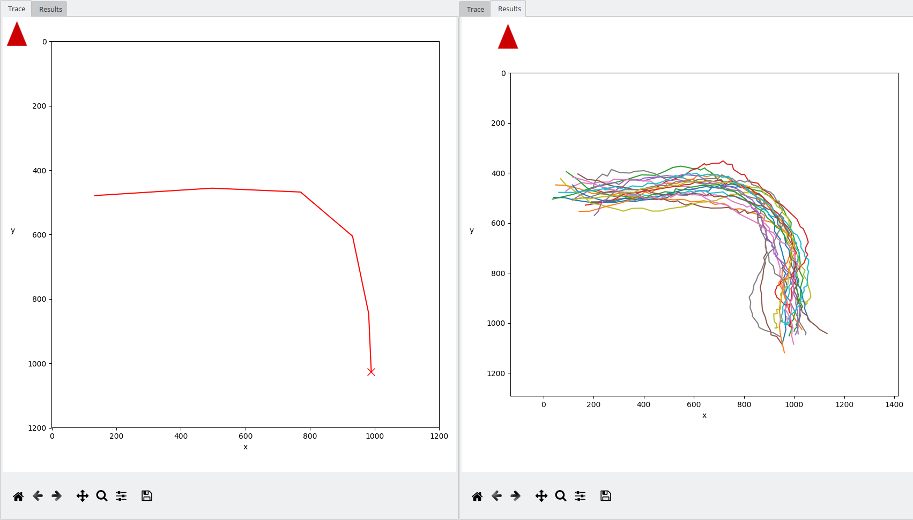
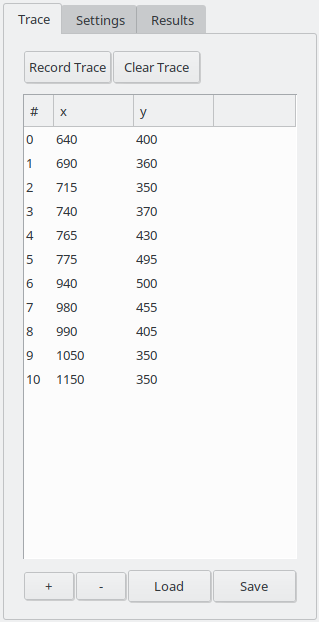

# TrajectoryGenerator
A Trajectory-Generator written in Python that creates Trajectories from
user-given Waypoints.

<p align="center">

<figcaption>Example Trajectories, generated with *TrajectoryGenerator*.</figcaption>
</p>

## Requirements

*TrajectoryGenerator* is written and tested with Python >= 3.6, but there 
are a number of additional packages required.

To avoid having to install all packages by hand, the usage of the 
[Anaconda](https://www.anaconda.com/) Python-Distribution is recommended.
With *Anaconda* it is possible to have multiple, isolated Python-environments, each with a different set of packages.
The proper use of the *Anaconda* Package management is documented [here](https://conda.io/docs/index.html).

For this project, all necessary dependencies are bundled in the top-level 
`environment.yml` file.

Simply run:
```
conda-env create -q -f environment.yml
```
to create a `conda`-environment containing all necessary Packages called `TrajectoryGenerator`(this has to be done only once) and afterwards activate it by typing:
```
source activate TrajectoryGenerator
```
## Usage

To start the program, make sure the *TrajectoryGenerator*-environment is
activated and type:
```
python trajectoryGenerator.py
```
This will bring up the main screen of the application.

<p align="center">

<figcaption>Startup screen of the application, divided into two different halves.</figcaption>
</p>

By default the program starts with an empty Simulation-environment.
Different Background-Images can be loaded via the menu-item
`Image -> Load Background`.

<p align="center">

<figcaption>Loading a different Simulation-environment.</figcaption>
</p>


The main screen is divided into two different panels.

The left one (Panel 1 in the image above) is used to display two different 
Plots, the *Trace*- and the *Results*-Plot.
The purpose of the *Trace*-Plot is to show the user-given Waypoints 
(which form a so called Trace) and to
provide a more comfortable input-method to directly create Waypoints by
clicking on the Plot while the program is recording this Waypoint-Trace.
The *Results*-Plot is used to show the generated Trajectories.
One can switch between the two plots by clicking on their associated tab in
the left corner on top of the plots.

<p align="center">

<figcaption>*Trace*-Plot showing the trace of Waypoints given by the user (*left*) and *Results*-Plot showing 20 generated Trajectories, based on the given *Trace* (*right*).</figcaption>
</p>


The right Panel (Panel 2) is used for the input of necessary Parameters and
is divided into three different tabs.
The first tab (*Trace*) displays the Trace of Waypoints the user creates.

<p align="center">

<figcaption>*Trace*-Tab with example Trace.</figcaption>
</p>

This Trace is shown as a list of Points in the middle of the tab as an
automatically generated Plot in the left *Trace*-Plot Panel.
There are three different methods of creating a Trace.
First it can be done visually, by clicking on the button *Record Trace*
and then clicking inside the *Trace*-Plot in the other Panel.
It can also be done manually by clicking on the *+*-Button on the bottom to
add a new point (set to *0,0*) and then editing the coordinates manually 
through double-clicking on the Values inside the Trace-List.
Lastly, it is also  possible to import a Trace by
clicking on the *Load*-Button.
This can be a previously generated Trace, saved by clicking on *Save*-Button,
or an arbitrary set of comma-separated values with one point per line, e.g.:

```
50,350
200,400
500,500
  ...
```

The possible methods of constructing of a trace is demonstrated in the 
following sequence:

<p align="center">

<figcaption>Example of different methods to create and manipulate a *Trace*.</figcaption>
</p>

The second Tab of the right Panel is the `Settings`-Tab.
The purpose of this tab is to provide all necessary Parameters for the 
generation of the Trajectories.

<p align="center">

<figcaption>*Settings*-Tab with example Values.</figcaption>
</p>

On top are two Fields to enter the values for the noise, used in the 
generation-process.
*Pre-$\sigma$* denotes gaussian noise (equally in *x*- and *y*-direction),
applied directly to the trace-values  **before** the generation of the 
Trajectories. 
This is to create more diverse Trajectories from one single Trace.
The *Post-$\sigma$* value represents noise applied to the  **already finished** Trajectories. This can be used to simulate measurement-noise. 

In the second part of the tab, the method to generate the Trajectories 
can be chosen.

---
*This part is still a work in progress, so this tab is still very much 
subject to change*

---
As of now, only the `Interpolation`-Method is fully implemented.
There, the supplied Trace is interpolated by the selected `Method` to 
generate the Trajectories.
The second Parameter, `Factor`, indicates by which Factor the resulting 
Trajectories have more Points than the original Trace.
For example, a Trace consisting of *10* Points and a Factor of *5* would
generate Trajectories, *50* Points long.

In the bottom Part are two more Parameters.
The first, `# Runs`, determines how many Trajectories should be generated
with the given Setting.
The `Label`-Parameter is used to label the generated Trajectories to tell 
them apart later on.

Finally on the very bottom is the *Run*-Button, which starts the Trajectory-generation.

Once the Trajectories are generated, they are shown in the *Results*-Plot 
and in the last Tab of the right Panel, the *Results*-Tab.

<p align="center">

<figcaption>*Results*-Tab on the right with three generated Trajectory-bundles.</figcaption>
</p>

The *Results*-Tab consists mainly of a List with all generated Trajectories.
The are numbered and labeled by the `Label`-Parameter of the *Settings*-Tab.
In this list, undesired Trajectories can be deleted by selecting them 
(multiple Trajectories can be selected by holding shift) and the clicking
the *-*-Button below the List.
If none of the simulated Trajectories are good enough, all Trajectories
can be deleted by clicking on *Clear All*.

After only the desired Trajectories are selected, this can be done by 
clicking on the individually while holding *Shift* or by selecting all with
the *Select All*-Button, the Trajectories are ready to export by clicking
on the Button named *Export*.
The Trajectories are exported to the *.hdf5*-format.
More Documentation on the Advantages and the Usage of *hdf5* can be found
[here](https://www.hdfgroup.org/).

The deletion and export of Trajectories is shown in the following clip:

<p align="center">

<figcaption>Deleting and exporting Trajectories.</figcaption>
</p>


## Example Workflow

The following clip shows an exemplary Workflow for the generation of
two Trajectory-bundles in a given room:


<p align="center">

<figcaption>Example-Workflow with *TrajectoryGenerator*.</figcaption>
</p>
